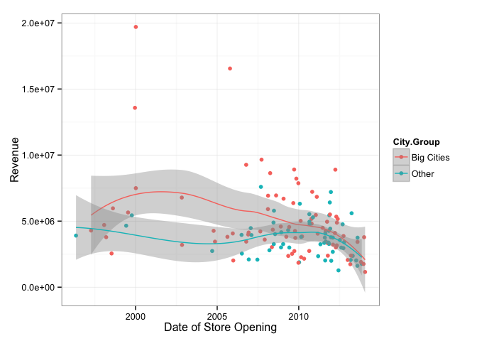
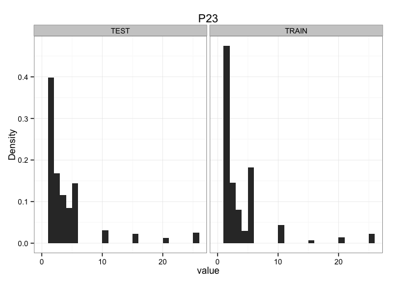
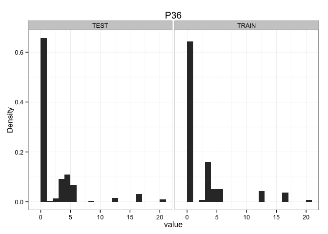

# Exploratory Analysis
Brad Dixon <rd729c@att.com>  
April 13, 2015  


# Variable Characterization

## Open Date

`date` is a parsed version of Open.Date.


```r
DATA %>%
  ggplot(aes(x=date, y=..density..)) +
    geom_histogram() +
    facet_wrap(~dataset) +
    xlab("Date of Store Opening") +
    ylab("Stores Opened (Density)") +
    theme_bw()
```

```
## stat_bin: binwidth defaulted to range/30. Use 'binwidth = x' to adjust this.
## stat_bin: binwidth defaulted to range/30. Use 'binwidth = x' to adjust this.
```

 


```r
DATA %>%
  filter(dataset=="TRAIN") %>%
  ggplot(aes(x=date, y=revenue)) +
    geom_point() +
    geom_smooth() +
    xlab("Date of Store Opening") +
    ylab("Revenue") +
    theme_bw()
```

```
## geom_smooth: method="auto" and size of largest group is <1000, so using loess. Use 'method = x' to change the smoothing method.
```

 

## City and City.Group


```r
get_map(location="Turkey", zoom=5) %>%
  ggmap +
  geom_point(data = DATA, aes(lon, lat, color=City.Group, shape=dataset), position = "jitter", size=2) +
  scale_shape_manual(values=c(0, 15))
```

```
## Map from URL : http://maps.googleapis.com/maps/api/staticmap?center=Turkey&zoom=5&size=640x640&scale=2&maptype=terrain&language=en-EN&sensor=false
## Information from URL : http://maps.googleapis.com/maps/api/geocode/json?address=Turkey&sensor=false
```

```
## Warning: Removed 298 rows containing missing values (geom_point).
```

 

Yep, its Turkey!


```r
setdiff(TEST$City, TRAIN$City)
```

```
##  [1] "Niğde"         "Rize"          "Düzce"         "Hatay"        
##  [5] "Erzurum"       "Mersin"        "Zonguldak"     "Malatya"      
##  [9] "Çanakkale"     "Kars"          "Batman"        "Bilecik"      
## [13] "Giresun"       "Sivas"         "Kırıkkale"     "Mardin"       
## [17] "Erzincan"      "Manisa"        "Kahramanmaraş" "Yalova"       
## [21] "Tanımsız"      "Kırşehir"      "Aksaray"       "Nevşehir"     
## [25] "Çorum"         "Ordu"          "Artvin"        "Siirt"        
## [29] "Çankırı"
```

**Issue**: Some cities found in TEST are not present in TRAIN.


```r
DATA %>%
  filter(dataset=="TRAIN") %>%
  ggplot(aes(x=date, y=revenue, color=City.Group)) +
    geom_point() +
    geom_smooth() +
    xlab("Date of Store Opening") +
    ylab("Revenue") +
    theme_bw()
```

```
## geom_smooth: method="auto" and size of largest group is <1000, so using loess. Use 'method = x' to change the smoothing method.
```

 

## Type


```r
summary(factor(TRAIN$Type))
```

```
## DT FC IL 
##  1 76 60
```

```r
summary(factor(TEST$Type))
```

```
##    DT    FC    IL    MB 
##  2244 57019 40447   290
```


```r
DATA %>%
  filter(dataset=="TRAIN") %>%
  ggplot(aes(x=date, y=revenue, color=Type)) +
    geom_point() +
    geom_smooth() +
    xlab("Date of Store Opening") +
    ylab("Revenue") +
    theme_bw()
```

```
## geom_smooth: method="auto" and size of largest group is <1000, so using loess. Use 'method = x' to change the smoothing method.
```

 

**Issue**: Missing an `MB` level in TRAIN.

# Mystery Variable Characterization

## Levels and Range Comparison


```r
DATA %>%
  group_by(dataset) %>%
  select(P1:P37) %>%
  summarise_each(funs(
    min = min(.),
    max = max(.),
    lev=length(unique(.))
    ), P1:P37) %>%
  gather(varname, value, P1_min:P37_lev) %>%
  group_by(varname) %>%
  summarize(
    min=min(value),
    max=max(value)
  ) %>%
  separate(varname, c("var", "metric")) %>%
  arrange(var, metric) %>%
  filter(min!=max) %>%
  print.data.frame
```

```
##    var metric  min  max
## 1   P1    lev  8.0  9.0
## 2   P1    max 12.0 15.0
## 3  P15    lev  8.0  9.0
## 4  P17    lev  9.0 10.0
## 5  P18    lev  7.0  9.0
## 6  P18    max 12.0 15.0
## 7   P2    lev  8.0  9.0
## 8  P21    lev  8.0  9.0
## 9  P25    lev  8.0  9.0
## 10 P27    lev  9.0 10.0
## 11 P29    lev  7.0  8.0
## 12 P29    max  7.5 10.0
## 13  P3    lev  7.0  8.0
## 14  P3    max  6.0  7.5
## 15 P30    lev  9.0 10.0
## 16 P33    lev  6.0  7.0
## 17 P34    lev  8.0 11.0
## 18 P34    max 24.0 30.0
## 19 P35    lev  7.0  8.0
## 20 P36    lev  8.0 10.0
## 21  P4    lev  6.0  7.0
## 22  P4    min  2.0  3.0
## 23  P5    lev  6.0  7.0
## 24  P5    max  6.0  8.0
## 25  P7    lev  6.0  7.0
## 26  P9    lev  4.0  5.0
```

**Issue**: Range discrepancies between TEST and TRAIN.

**Issue**: Some of the mystery variables have differing numbers of distinct values.

## Histograms


```r
P_mv_histogram = DATA %>%
  select(dataset, P1:P37) %>%
  gather(varname, value, P1:P37) %>%
  select(varname, dataset, value) %>%
  group_by(varname) %>%
  do(
    plot = ggplot(., aes(x=value, y=..density..)) +
      geom_histogram(binwidth=1) +
      ggtitle(.$varname) +
      facet_wrap( ~ dataset) +
      ylab("Density") +
      theme_bw()
  )

P_mv_histogram %>%
  rowwise %>%
  do({
    print(.$plot)
    data.frame()
  })
```

                                     

```
## Source: local data frame [0 x 0]
## Groups: <by row>
```
