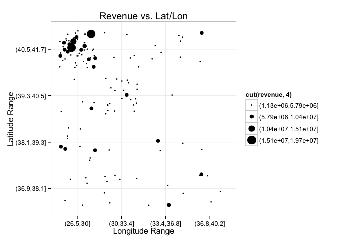

# Exploratory Analysis


# Independent Variable Characterization


```r
DATA %>%
  filter(dataset=="TRAIN") %>%
  ggplot(aes(revenue)) +
  geom_density() +
  geom_vline( aes(xintercept=mean(revenue) ), color="blue") +
  geom_vline( aes(xintercept=mean(revenue)+3*sd(revenue) )) +
  geom_vline( aes(xintercept=mean(revenue)+2*sd(revenue) )) +
  geom_vline( aes(xintercept=mean(revenue)+sd(revenue) )) +
  geom_vline( aes(xintercept=mean(revenue)-sd(revenue) )) +
  theme_bw()
```

 

Blue line is mean. Black lines are 1, 2, 3 SD's from the mean.

# Dependent Variable Characterization

## Open Date

`date` is a parsed version of Open.Date.


```r
DATA %>%
  ggplot(aes(x=date, y=..density..)) +
    geom_histogram() +
    facet_wrap(~dataset) +
    xlab("Date of Store Opening") +
    ylab("Stores Opened (Density)") +
    theme_bw()
```

```
## stat_bin: binwidth defaulted to range/30. Use 'binwidth = x' to adjust this.
## stat_bin: binwidth defaulted to range/30. Use 'binwidth = x' to adjust this.
```

 


```r
DATA %>%
  filter(dataset=="TRAIN") %>%
  ggplot(aes(x=date, y=revenue)) +
    geom_point() +
    geom_smooth() +
    xlab("Date of Store Opening") +
    ylab("Revenue") +
    theme_bw()
```

```
## geom_smooth: method="auto" and size of largest group is <1000, so using loess. Use 'method = x' to change the smoothing method.
```

 

## City and City.Group


```r
# get_map(location="Turkey", zoom=5) %>%
#   ggmap +
#   geom_point(data = DATA, aes(lon, lat, color=City.Group, shape=dataset), position = "jitter", size=2) +
#   scale_shape_manual(values=c(0, 15))
```

Yep, its Turkey!


```r
setdiff(TEST$City, TRAIN$City)
```

```
##  [1] "Niğde"         "Rize"          "Düzce"         "Hatay"        
##  [5] "Erzurum"       "Mersin"        "Zonguldak"     "Malatya"      
##  [9] "Çanakkale"     "Kars"          "Batman"        "Bilecik"      
## [13] "Giresun"       "Sivas"         "Kırıkkale"     "Mardin"       
## [17] "Erzincan"      "Manisa"        "Kahramanmaraş" "Yalova"       
## [21] "Tanımsız"      "Kırşehir"      "Aksaray"       "Nevşehir"     
## [25] "Çorum"         "Ordu"          "Artvin"        "Siirt"        
## [29] "Çankırı"
```

```r
setdiff(TRAIN$City, TEST$City)
```

```
## [1] "Tokat"     "Elazığ"    "Kastamonu" "Karabük"   "Amasya"    "Osmaniye"
```

```r
table(DATA$dataset, DATA$City)
```

```
##        
##         Adana Afyonkarahisar Aksaray Amasya Ankara Antalya Artvin Aydın
##   TEST   2514            331     650      0   8720    5911    344  1617
##   TRAIN     3              1       0      1     19       4      0     2
##        
##         Balıkesir Batman Bilecik  Bolu Bursa Çanakkale Çankırı Çorum
##   TEST       2463    604     339   631  2441       965     309   304
##   TRAIN         1      0       0     1     5         0       0     0
##        
##         Denizli Diyarbakır Düzce Edirne Elazığ Erzincan Erzurum Eskişehir
##   TEST      964        954   303   1230      0      319     317       900
##   TRAIN       1          3     0      1      1        0       0         3
##        
##         Gaziantep Giresun Hatay Isparta İstanbul İzmir Kahramanmaraş
##   TEST       1487     310   951     304    34087  6465           315
##   TRAIN         1       0     0       1       50     9             0
##        
##         Karabük  Kars Kastamonu Kayseri Kırıkkale Kırklareli Kırşehir
##   TEST        0   289         0     323       622        281      319
##   TRAIN       1     0         1       3         0          1        0
##        
##         Kocaeli Konya Kütahya Malatya Manisa Mardin Mersin Muğla Nevşehir
##   TEST     4364  1576     304     616   1227    610   2735  1823      328
##   TRAIN       1     2       1       0      0      0      0     2        0
##        
##         Niğde  Ordu Osmaniye  Rize Sakarya Samsun Şanlıurfa Siirt Sivas
##   TEST    310   317        0   345     604    324       609   315   326
##   TRAIN     0     0        1     0       4      5         1     0     0
##        
##         Tanımsız Tekirdağ Tokat Trabzon  Uşak Yalova Zonguldak
##   TEST       298     1577     0     660   293    630       926
##   TRAIN        0        3     1       2     1      0         0
```

```r
table(DATA$dataset, DATA$City.Group)
```

```
##        
##         Big Cities Other
##   TEST       49272 50728
##   TRAIN         78    59
```

**Issue**: Some cities found in TEST are not present in TRAIN.


```r
DATA %>%
  filter(dataset=="TRAIN") %>%
  ggplot(aes(x=date, y=revenue, color=City.Group)) +
    geom_point() +
    geom_smooth() +
    xlab("Date of Store Opening") +
    ylab("Revenue") +
    theme_bw()
```

```
## geom_smooth: method="auto" and size of largest group is <1000, so using loess. Use 'method = x' to change the smoothing method.
```

 


```r
DATA %>%
  filter(dataset=="TRAIN") %>%
  ggplot(aes( month(date), revenue, color=City.Group)) +
    geom_point() +
    geom_smooth() +
    theme_bw()
```

```
## geom_smooth: method="auto" and size of largest group is <1000, so using loess. Use 'method = x' to change the smoothing method.
```

 

## Type


```r
table(DATA$dataset, DATA$Type)
```

```
##        
##            DT    FC    IL    MB
##   TEST   2244 57019 40447   290
##   TRAIN     1    76    60     0
```


```r
DATA %>%
  filter(dataset=="TRAIN") %>%
  ggplot(aes(x=date, y=revenue, color=Type)) +
    geom_point() +
    geom_smooth() +
    xlab("Date of Store Opening") +
    ylab("Revenue") +
    theme_bw()
```

```
## geom_smooth: method="auto" and size of largest group is <1000, so using loess. Use 'method = x' to change the smoothing method.
```

 

**Issue**: Missing an `MB` level in TRAIN.

## Lat/Lon


```r
DATA %>%
  filter(dataset=="TRAIN") %>%
  ggplot(aes(lat, revenue)) +
  geom_line() +
  geom_smooth()
```

```
## geom_smooth: method="auto" and size of largest group is <1000, so using loess. Use 'method = x' to change the smoothing method.
```

 

```r
DATA %>%
  filter(dataset=="TRAIN") %>%
  ggplot(aes(lon, revenue)) +
  geom_line() +
  geom_smooth()
```

```
## geom_smooth: method="auto" and size of largest group is <1000, so using loess. Use 'method = x' to change the smoothing method.
```

 

```r
DATA %>%
  filter(dataset=="TRAIN") %>%
  ggplot( ) +
  geom_point( aes( cut(lon,4), cut(lat,4), size=cut(revenue,4)), position="jitter" ) +
  theme_bw() +
  xlab("Longitude Range") +
  ylab("Latitude Range") +
  ggtitle("Revenue vs. Lat/Lon")
```

 

# Mystery Variable Characterization

## Levels and Range Comparison


```r
MV_RANGES = DATA %>%
  group_by(dataset) %>%
  select(P1:P37) %>%
  summarise_each(funs(
    min = min(.),
    max = max(.),
    lev = length(unique(.))
    ), P1:P37) %>%
  gather(varname, value, P1_min:P37_lev) %>%
  group_by(varname) %>%
  summarize(
    min=min(value),
    max=max(value)
  ) %>%
  separate(varname, c("var", "metric")) %>%
  arrange(var, metric) %>%
  mutate(
    odd = ifelse(
      min != max,
      TRUE, FALSE)
  )

# How many discrepancies of each type
table(MV_RANGES$odd, MV_RANGES$metric)
```

```
##        
##         lev max min
##   FALSE  18  31  36
##   TRUE   19   6   1
```

```r
# Print discrepancies
MV_RANGES %>%
  filter(odd) %>%
  print.data.frame
```

```
##    var metric  min  max  odd
## 1   P1    lev  8.0  9.0 TRUE
## 2   P1    max 12.0 15.0 TRUE
## 3  P15    lev  8.0  9.0 TRUE
## 4  P17    lev  9.0 10.0 TRUE
## 5  P18    lev  7.0  9.0 TRUE
## 6  P18    max 12.0 15.0 TRUE
## 7   P2    lev  8.0  9.0 TRUE
## 8  P21    lev  8.0  9.0 TRUE
## 9  P25    lev  8.0  9.0 TRUE
## 10 P27    lev  9.0 10.0 TRUE
## 11 P29    lev  7.0  8.0 TRUE
## 12 P29    max  7.5 10.0 TRUE
## 13  P3    lev  7.0  8.0 TRUE
## 14  P3    max  6.0  7.5 TRUE
## 15 P30    lev  9.0 10.0 TRUE
## 16 P33    lev  6.0  7.0 TRUE
## 17 P34    lev  8.0 11.0 TRUE
## 18 P34    max 24.0 30.0 TRUE
## 19 P35    lev  7.0  8.0 TRUE
## 20 P36    lev  8.0 10.0 TRUE
## 21  P4    lev  6.0  7.0 TRUE
## 22  P4    min  2.0  3.0 TRUE
## 23  P5    lev  6.0  7.0 TRUE
## 24  P5    max  6.0  8.0 TRUE
## 25  P7    lev  6.0  7.0 TRUE
## 26  P9    lev  4.0  5.0 TRUE
```

**Issue**: Range discrepancies between TEST and TRAIN.

**Issue**: Some of the mystery variables have differing numbers of distinct values.

Clint has a theory that the mystery vars with small numbers of levels
are candidates for categorical treatment. Lets see.


```r
MV_ODD = MV_RANGES %>%
  group_by(var) %>%
  mutate(
    odd = any(odd)
  ) %>%
  filter(metric=="lev") %>%
  select(
    lev = min,
    odd
  )
table(MV_ODD$odd, MV_ODD$lev)
```

```
##        
##         4 5 6 7 8 9 10
##   FALSE 1 2 0 1 4 6  4
##   TRUE  1 0 4 4 7 3  0
```

Inconclusive.

## Histograms


```r
P_mv_histogram = DATA %>%
  select(dataset, P1:P37) %>%
  gather(varname, value, P1:P37) %>%
  select(varname, dataset, value) %>%
  group_by(varname) %>%
  do(
    plot = ggplot(., aes(x=value, y=..density..)) +
      geom_histogram(binwidth=1) +
      ggtitle(.$varname) +
      facet_wrap( ~ dataset) +
      ylab("Density") +
      theme_bw()
  )

P_mv_histogram %>%
  rowwise %>%
  do({
    print(.$plot)
    data.frame()
  })
```

                                     

```
## Source: local data frame [0 x 0]
## Groups: <by row>
```

# Correlated Predictors


```r
TRAIN.P.cor = cor(select(TRAIN, P1:P37))
colnames(
  TRAIN[,findCorrelation(TRAIN.P.cor, cutoff = .95)]
  )
```

```
## [1] "P31" "P11" "P21" "P5"  "P4"
```

# Linear Combinations

```r
TRAIN.P.lc = findLinearCombos(select(TRAIN, P1:P37))
```

# Zero in Data

```r
X = apply(DATA, 1, function(r) {
  length(which(r[6:43]==0))
})
```
