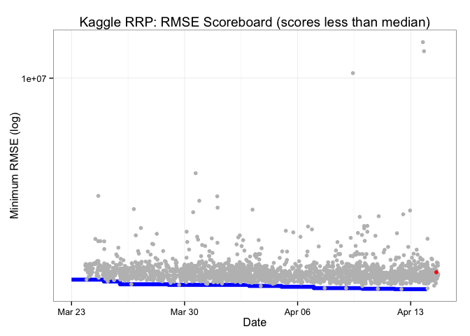

# Submission Scoreboard


```r
ggplot(SCOREBOARD_BEST, aes(ymd(date), minrmse)) +
  geom_step(color="blue", size=2) +
  geom_point(data = filter(SCOREBOARD, !us, Score<median(Score)), aes(SubmissionDate, Score), color="grey") +
  geom_point(data = filter(SCOREBOARD, us), aes(SubmissionDate, Score), color="red") +
  xlab("Date") +
  ylab("Minimum RMSE (log)") +
  scale_y_log10() +
  theme_bw() +
  ggtitle("Kaggle RRP: RMSE Scoreboard (scores less than median)")
```

 
